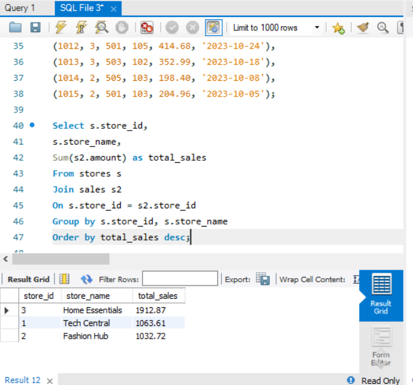
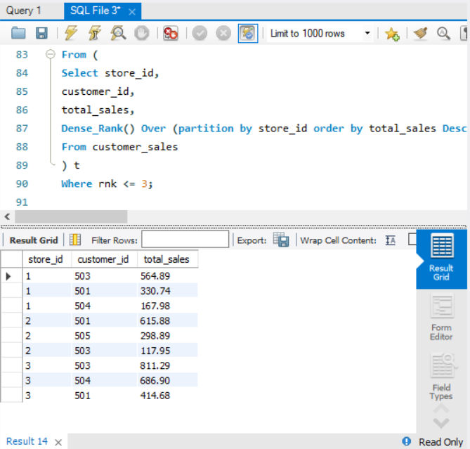
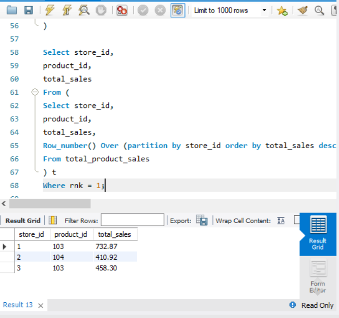

# 🏬 Retail Store Performance Analysis

## 📌 Business Problem
Analyze store-level performance to identify:
- Top-performing stores
- Best-selling products
- High-value customers

---

## 🛠️ Tools Used
- SQL (MySQL Workbench)

---

## 🔍 Key Analysis
- Total sales per store
- Best-selling product per store
- Top 3 customers per store
- Average transaction value

---

## 📈 Key Insights
- Store Home Essentials generates highest revenue
- Certain products dominate sales across stores
- Top 3 customers contribute significant portion of store revenue

---

## 💡 Recommendations
- Focus marketing on high-value customers
- Optimize inventory for best-selling products
- Improve performance of low-revenue stores

---

# 🏬 Retail Store Performance Analysis

## 📌 Business Problem
Analyze store-level performance to identify:
- Top-performing stores
- Best-selling products
- High-value customers

---

## 🛠️ Tools Used
- SQL (MySQL Workbench)

---

## 🔍 Key Analysis
- Total sales per store
- Best-selling product per store
- Top 3 customers per store
- Average transaction value

---

## 📈 Key Insights
- Store X generates highest revenue
- Certain products dominate sales across stores
- Top 3 customers contribute significant portion of store revenue

---

## 💡 Recommendations
- Focus marketing on high-value customers
- Optimize inventory for best-selling products
- Improve performance of low-revenue stores

---

## 📊 Sample Outputs

### Total Sales

### Top 3 Customers

### Storewise Best Selling Product

